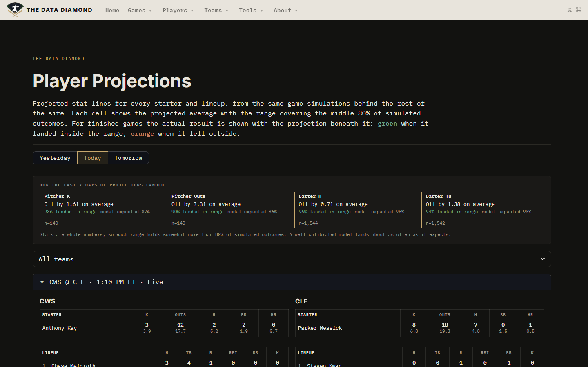
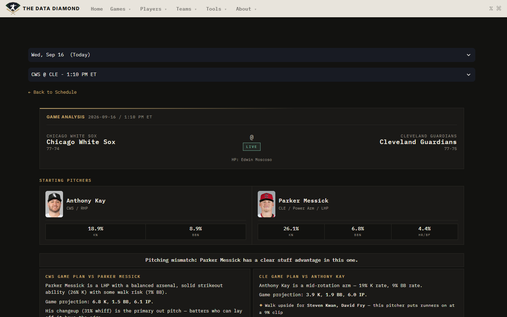
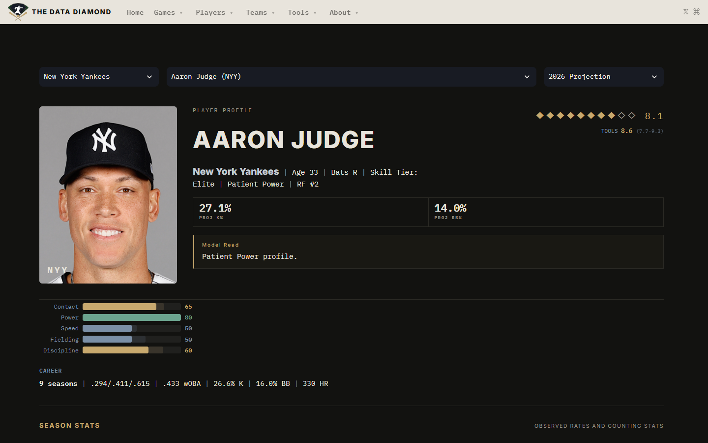

# The Data Diamond

Bayesian MLB player projections, simulated plate appearance by plate appearance, published daily and scored against what actually happened.

**Live site: [thedatadiamondprojections.streamlit.app](https://thedatadiamondprojections.streamlit.app)**



Every projection on the site carries a range, and every finished game is graded against it. The page above shows both: today's slate with each hitter's and starter's projected line, and a strip reporting how often the last week's results actually landed inside the ranges the model drew.

---

## What makes this different from a stat site

**It grades itself in public.** The Preseason Scorecard takes projections frozen before Opening Day and names names: of 34 hitters projected as stars, 22 delivered; Juan Soto was called within 2 points of wRC+, Vladimir Guerrero Jr. was missed by 40. It also reports what does not work, including a projected ERA with almost no ranking power and the run-conversion bug behind it.

**It publishes its own error.** The accuracy strip compares how often outcomes landed in range against how often the model *expected* them to. Counting stats are whole numbers, so a 10th-to-90th percentile range holds more than 80% of the simulated mass; quoting only the hit rate would flatter the model. Comparing observed coverage against the model's own expected coverage is the honest version, and it currently shows batter stats well calibrated and pitcher ranges slightly too wide.

**Projections are distributions, not point estimates.** Each player carries 1,000 posterior draws per rate stat. The game simulator resolves a full lineup one plate appearance at a time, so the output is a joint distribution over K, BB, H, HR, TB and outs rather than an independent guess per stat.

**Season projections never peek.** The full-season rate projections (AVG/OBP/SLG/OPS, ERA/WHIP/FIP) come from a snapshot frozen before Opening Day, trained on 2018-2025 only. They cannot see how a player is performing this year, which is the only way a preseason projection can be judged fairly in September.

---

## How it works

```
mlb_fantasy_ETL          player_profiles              tdd-dashboard (this repo)
Statcast + MLB API  ->   Bayesian rate models    ->   Streamlit UI
PostgreSQL               PA-by-PA simulator           reads artifacts from R2
                         writes parquet artifacts
                                   |
                                   +--> Cloudflare R2 <-- published each cycle
```

Three repos, one direction of travel. This one is the presentation layer: it renders pre-computed artifacts and holds the daily pipeline that produces and publishes them. No model training and no database queries happen in the app.

### The model

- **Hierarchical Bayesian rate models** for K%, BB% and HR rate, with priors from career performance, age curves, park factors and batted-ball profiles.
- **Beta-Binomial conjugate updating** folds in-season results into those rates daily, so a hot April does not overwrite four years of prior.
- **A plate-appearance simulator** runs each matchup 5,000 times, drawing from both the pitcher's and the hitter's posteriors, and adjusting for the opposing lineup, umpire tendencies, park, weather, times through the order, and pitch-count fatigue.
- **Season-long projections** simulate 10,000 full seasons per player, producing correlated totals and rate lines with credible intervals.

### The daily pipeline

Two scheduled tasks, no manual steps:

| When | What runs |
|---|---|
| 6:00 AM | ETL for yesterday, precompute, projection update, team-run scoring, full slate simulation, publish |
| Every 15 min, 9 AM to midnight | Re-simulate only games whose starter, home plate umpire, or confirmed lineup changed; refresh live results; publish |

The intraday refresh is change-driven. It fingerprints each game's inputs and skips the simulation entirely when nothing has moved, which is most of the time: a typical run finishes in about 20 seconds instead of two-plus minutes. Lineups genuinely change the numbers (a pitcher's strikeout projection is simulated against the nine hitters he will actually face), so re-simulating on a lineup post is not cosmetic.

Artifacts publish to Cloudflare R2, not to git. A data refresh therefore never redeploys the app, and the site picks up new numbers on its own cache timer. The app reads local files when present and falls back to the bucket, so development stays offline and a bucket outage degrades to stale data rather than a blank page.

---

## The pages

| Page | What it answers |
|---|---|
| **Player Projections** | What is every starter and lineup projected to do today, and how did past projections land? |
| **Game Analysis** | What shapes this specific matchup: game plans, bullpens, park, umpire, season series, per-pitcher distributions |
| **Player Profile** | One player's projections, percentiles, scouting report, zone charts and season trends |
| **Projections** | Full-season leaderboards from the frozen preseason snapshot, rate and counting |
| **Preseason Scorecard** | Which projected stars delivered and which duds stayed duds, player by player, plus how the breakout calls landed |
| **Model Performance** | Predicted vs actual, calibration curves, backtests, biggest hits and misses |
| **Team Overview / Rankings** | Team identity, strengths and weaknesses against the league, depth |
| **Data Health** | Artifact freshness, inventory and contract validation |





---

## Running it

```bash
pip install -r requirements.txt
streamlit run app.py
```

With no local data, set `TDD_ARTIFACT_BASE_URL` to the public bucket and the app will pull what it needs:

```bash
export TDD_ARTIFACT_BASE_URL=https://pub-507219cfdcb94d45b71784dbf880db4e.r2.dev
streamlit run app.py
```

Pipeline work needs the extra dependencies and credentials:

```bash
pip install -r requirements-pipeline.txt   # boto3, database drivers
python scripts/update_in_season.py          # projections + bookkeeping
python scripts/publish_artifacts.py --dry-run
```

`scripts/daily_update.bat` is the Windows task entry point; `scripts/setup_scheduled_tasks.ps1` registers the two scheduled tasks.

## Layout

```
app.py                  entry point, nav, routing
views/                  one module per page
components/             shared render pieces (tables, cards, charts, attribution)
services/               artifact resolution (local -> R2), data loaders, manifest contracts
lib/                    computation modules synced from the projection repo
scripts/                daily pipeline, artifact publishing, validation
tests/                  91 tests
```

Run the suite with `pytest`.

---

Data from Statcast and the MLB Stats API. Built by Kekoa Santana. Model projections for research and analysis. Not affiliated with MLB.
